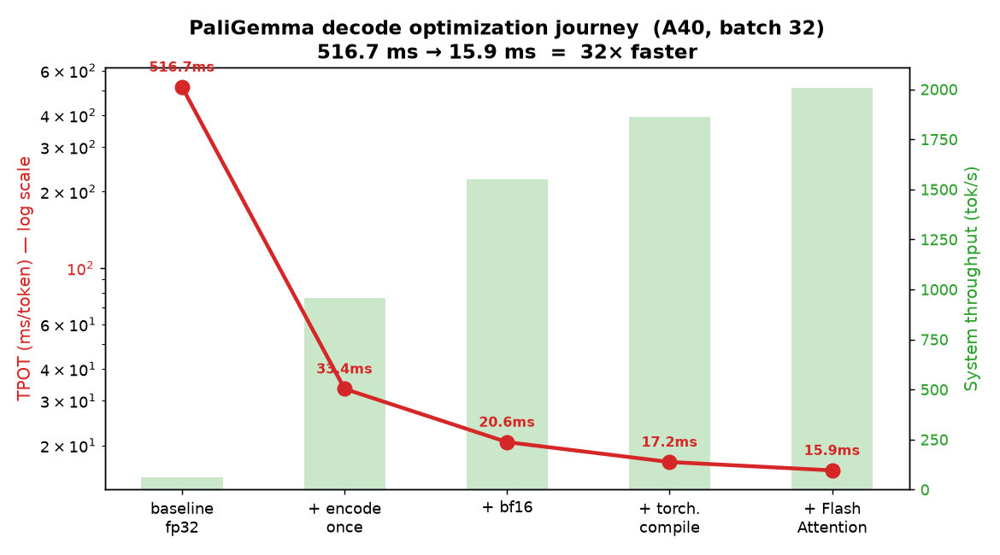
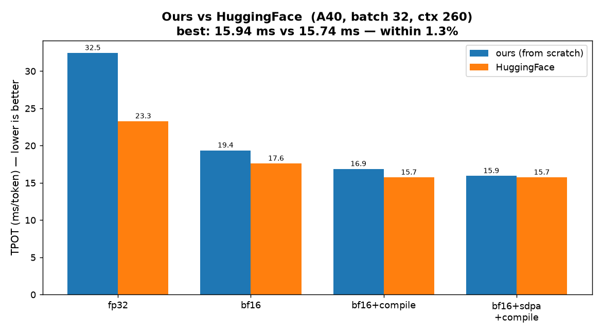
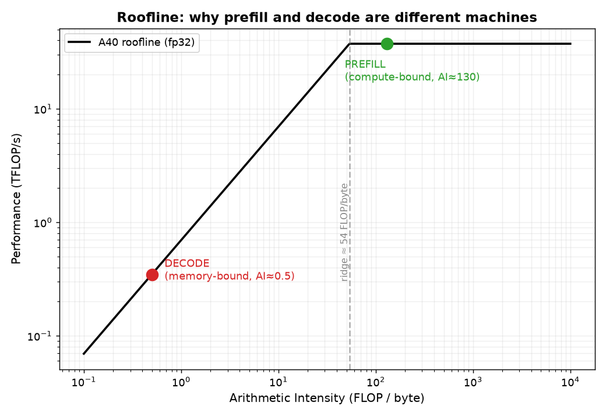

# PaliGemma from Scratch → Optimized: a 32× Inference-Engineering Journey

A **from-scratch PyTorch implementation** of Google's **PaliGemma** vision-language
model, turned into a hands-on **LLM inference-optimization tutorial**. I profile the
naive implementation, diagnose the bottlenecks with a roofline model, and apply four
optimizations to make decode **32× faster** — landing **within 1.3% of HuggingFace
`transformers`**, with **identical output** at every step.

> This repo is as much about **how to think about inference performance** (TTFT, TPOT,
> HBM bandwidth, compute- vs memory-bound, kernel fusion, FlashAttention) as it is about
> PaliGemma itself. Every claim is **measured** on an NVIDIA A40 and reproducible.

---

## 🏁 Headline result



| stage | TPOT (ms/token) | system throughput | speedup |
|-------|----------------:|------------------:|--------:|
| baseline (fp32, naive) | **516.7 ms** | 61.9 tok/s | 1× |
| + encode image once | 33.4 ms | 958.5 tok/s | **15×** |
| + bf16 weights | 20.6 ms | 1552 tok/s | 25× |
| + torch.compile | 17.2 ms | 1863 tok/s | 30× |
| + FlashAttention (SDPA) | **15.94 ms** | **2007 tok/s** | **32×** |

*(A40, batch 32, context 260, greedy decode, prompt `"caption en"`.)*

### This matches HuggingFace


This fully-optimized decode (**15.94 ms**) is within **1.3%** of HuggingFace's
production implementation (**15.74 ms**), and **TTFT is identical**. The last sliver is
HF's CUDA-graph integration (see [the CUDA-graph wall](#the-cuda-graph-wall)).

---

## 📚 The two metrics that rule inference: TTFT & TPOT

Generation has **two stages with opposite performance characteristics**:

| Metric | Means | Stage | Bound by | What a user feels |
|--------|-------|-------|----------|-------------------|
| **TTFT** (Time To First Token) | request → first token | **prefill** | **compute** | responsiveness |
| **TPOT** (Time Per Output Token) | steady-state per-token | **decode** | **memory bandwidth** | "typing speed" |

`total latency = TTFT + (num_tokens − 1) × TPOT`.

### Why they differ: the roofline


**Arithmetic Intensity (AI)** = FLOPs ÷ bytes moved from HBM. The A40's *ridge point* is
`37.4 TFLOP/s ÷ 696 GB/s ≈ 54 FLOP/byte`.

- **Prefill** processes the whole prompt at once → each weight is reused across hundreds
  of tokens → **AI ≈ 130** → *far above* the ridge → **compute-bound** (sets TTFT).
- **Decode** processes **one token** at a time → must read *all* weights for a sliver of
  math → **AI ≈ 0.5** → *far below* the ridge → **memory-bound** (sets TPOT).

You can literally *see* this in the profiler: prefill runs **GEMM** (`sgemm`) kernels,
decode runs **GEMV** (`gemv`) kernels — same model, different regime. Seeing GEMV instead
of GEMM is how you spot the decode regime. See [`docs/PERF_ENGINEERING.md`](docs/PERF_ENGINEERING.md).

---

## 🔬 How I measured HBM traffic

"Decode is memory-bound" is a claim — so I **measured** it. There are three levels:

### 1. Achieved-bandwidth method (what this repo uses — practical, no special tools)
Model the bytes moved per decode step, divide by the measured step time:
```
weight_bytes  = params × dtype_bytes                       # all weights read once/step
kv_read_bytes = 2 × layers × batch × kv_heads × seq_len × head_dim × dtype_bytes
achieved_BW   = (weight_bytes + kv_read_bytes) / step_time
```
Then compare to the GPU's peak (696 GB/s on A40). **If achieved_BW → peak, you're
memory-bandwidth-bound.** `hbm_kv_study.py` prints this as `ach_GB/s` and `%peak`.

> **Key diagnostic I found:** the *naive* model achieved only **3% of peak** — meaning
> it was *not* memory-bound but **overhead/waste-bound** (the redundant vision tower +
> unfused kernels). After optimizing, decode reached a genuine memory-bound regime
> (~50% of peak). **A low achieved-BW on a "memory-bound" workload is itself the signal
> that something else (waste/overhead) is the real bottleneck.**

### 2. Hardware counters (gold standard) — NVIDIA Nsight Compute
For exact DRAM bytes per kernel:
```bash
ncu --metrics dram__bytes_read.sum,dram__bytes_write.sum python inference_optimized.py ...
```
`ncu` reads the GPU's actual memory-controller counters. It's precise but slow (serializes
kernels) and needs the Nsight Compute CLI installed.

### 3. Utilization proxy — `nvidia-smi dmon`
`nvidia-smi dmon` shows % memory-controller activity — coarse, zero-setup, good for a
quick "is the memory system saturated?" check.

I also measure **KV-cache pressure** (memory + bandwidth) as context grows. On this model
it's tiny — it uses **multi-query attention (1 KV head)** — confirming KV pressure is
mostly a *serving-scale* (many heads × long context × big batch) concern.

---

## ⚙️ The four optimizations (and why each works)

| # | Optimization | Fixes | Lever | Gain |
|---|--------------|-------|-------|------|
| 1 | **Encode image once** | vision tower re-run every decode step (~62% of kernels, discarded) | remove wasted *work* | **15×** |
| 2 | **bf16 weights** | fp32 reads 11.7 GB/step | move *fewer bytes* | 25× cum. |
| 3 | **torch.compile** | ~2,000 unfused kernels/token | fuse kernels / cut launch overhead | 30× cum. |
| 4 | **FlashAttention (SDPA)** | attention materializes score matrix in HBM | fused attention kernel (less HBM traffic) | **32× cum.** |

Details, measured before/afters, and the full reasoning: [`docs/OPTIMIZATION_PLAN.md`](docs/OPTIMIZATION_PLAN.md).

### The CUDA-graph wall
I also attempted **CUDA graphs** (`torch.compile(mode="reduce-overhead")`) via a
pre-allocated **`StaticKVCache`**. It gracefully *skipped* — a genuinely instructive
finding. CUDA graphs require **static shapes + all-GPU inputs + no in-place mutation of
graph inputs**. The KV cache mutates buffers passed as inputs, and the per-step position
is a Python int. The full fix is the **gpt-fast / vLLM recipe**: register KV buffers as
model buffers and pass `input_pos` as a device tensor. That structural refactor is exactly
what separates a hand-written model from a production engine — and it's the remaining 1.3%.

---

## 🚀 Quick start

### 1. Install
```bash
pip install -r requirements.txt
```

### 2. Get the weights (gated — accept the license first)
```bash
# accept at https://huggingface.co/google/paligemma-3b-pt-224
export HF_TOKEN=hf_xxx
python -c "from huggingface_hub import snapshot_download; import os; \
  snapshot_download('google/paligemma-3b-pt-224', \
  local_dir=os.path.expanduser('~/paligemma-3b-pt-224'), token=os.environ['HF_TOKEN'], \
  allow_patterns=['*.safetensors','*.json','*.model','tokenizer*'])"
```

### 3. Run optimized inference
```bash
python inference_optimized.py \
  --model_path ~/paligemma-3b-pt-224 \
  --prompt "caption en" \
  --image_file_path test_images/pic1.jpeg \
  --max_tokens_to_generate 100
# prints: TTFT: 32 ms | TPOT: 10.5 ms/token | ...
```
Toggle any optimization: `--dtype float32 --sdpa False --compile False`.

---

## 🗂️ Repository map

### Core model (from scratch)
| File | Role |
|------|------|
| `modeling_siglip.py` | SigLIP vision encoder (ViT) |
| `modeling_gemma.py` | Gemma LM, KV cache, `StaticKVCache`, SDPA toggle, the multimodal merge |
| `processing_paligemma.py` | image + text preprocessing |
| `utils.py` | load weights from safetensors |

### Inference
| File | Role |
|------|------|
| `inference.py` | baseline (naive) generation loop |
| `inference_optimized.py` | ⭐ all optimizations combined |

### Benchmarking & profiling toolkit
| File | Measures |
|------|----------|
| `benchmark_inference.py` | prefill/decode/KV-cache metrics (batch 1) |
| `batch_study.py` | throughput vs batch size (GPU utilization) |
| `hbm_kv_study.py` | TTFT/TPOT + **HBM traffic** + KV-cache pressure |
| `profile_inference.py` | kernel-level profiler + roofline + launch attribution |
| `hf_compare.py` | ours vs HuggingFace `transformers` |
| `make_plots.py` | generates the charts in this README |

### Tutorials & docs
| Path | Content |
|------|---------|
| `profiling_hello_world.py` | learn `torch.profiler`: GEMM↔GEMV flip, launch overhead, `torch.compile` fusion |
| `docs/COURSEWORK_INFERENCE.md` | architecture deep-dive (prefill/decode/KV cache, code-anchored) |
| `docs/PERF_ENGINEERING.md` | roofline, TTFT/TPOT, throughput formulas, compute vs memory bound |
| `docs/BENCHMARKING.md` | metrics reference + how to run |
| `docs/OPTIMIZATION_PLAN.md` | the full results log (the journey) |
| `stage2_vllm/` | production serving with vLLM + concurrency load test |

---

## 🧠 What you'll learn

- The **prefill vs decode** split and why they're "two different machines."
- **TTFT / TPOT** and how to convert `ms/step` ↔ `tokens/sec` (per-user vs system).
- The **roofline model**: compute-bound vs memory-bound, arithmetic intensity, ridge point.
- How to **profile** with `torch.profiler` and read kernel tables (GEMM vs GEMV, launch counts).
- How to **measure HBM traffic** (achieved-bandwidth, Nsight Compute, `nvidia-smi`).
- Why **batching** helps throughput but hurts per-user latency (and how to pick a batch size).
- The real wins: **remove wasted work**, **lower precision**, **fuse kernels**, **FlashAttention**.
- Why **CUDA graphs** are hard (the static-cache / `input_pos` refactor) — the vLLM frontier.

---

## 📋 PaliGemma design notes

- **Architecture:** SigLIP vision encoder → linear projector → Gemma decoder (one checkpoint).
- **Prefix-LM attention:** the image + prompt (prefix) attend **bidirectionally**; only the
  generated answer is causal. That's why the attention mask here is all-zeros (not causal),
  and why I pass `attn_mask=...` (not `is_causal=True`) to SDPA.
- **Image tokens:** 256 = (224/14)² patches, injected into `<image>` placeholder slots.
- **Attention:** multi-query (1 KV head) → tiny KV cache.
- **Context window:** 8192 tokens (RoPE).

---

## 🔭 Stage 2: production serving (vLLM)

The optimizations here target a **single-stream** model. Production serving adds
**continuous batching** + **PagedAttention** (vLLM) to serve many concurrent users. See
[`stage2_vllm/`](stage2_vllm/) for a serving + concurrency load-test harness.

---

## Credits
Model implementation follows the PaliGemma / Gemma / SigLIP architectures by Google.
This repo adds the optimization journey, profiling toolkit, and educational docs.
Weights © Google, under the PaliGemma license (gated on Hugging Face).
